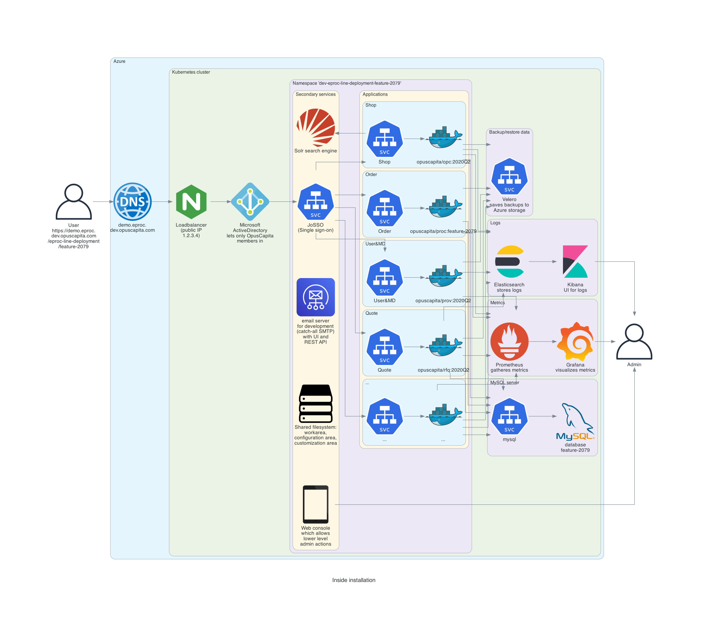

# Automated deployments for eProcurement development

Speaker: Egor Stambakio

---


---

# Use cases

- test integration between several applications (for example Shop -> Procurement order flow)
- execute automated tests in browser
- test manually in browser
- showcase installations, presentations

---


---

# We also want:

- **repeatable builds** (2 QA have 2 equal deployments)
- **easy configuration** (everyone can do it)
- **persistent configuration** (how it was configured?)
- **observability** (how many do we have? do they cost money? who created this deployment? does this person really need 5 installations at once?)
- **automated operations** (no need to ask anyone to create, update or delete installation)
- **cost efficiency** (consume cloud resources only when needed)

---

# How it's achieved:

- **repeatable builds** - Continuous Integration (CircleCI)
- **easy configuration** - User interface (web application)
- **persistent configuration** - Github
- **observability** - list of installations on UI and messages in Slack channel, with all relevant information (owner(s), uptime status, etc.)
- **automated operations** - Continuous Integration (CircleCI)
- **cost efficiency** - every installation can be turned On/Off, or work only during the working hours

---


---

# User Interface

Github: [OpusCapita/eproc-line-launcher](https://github.com/OpusCapita/eproc-line-launcher)

```markdown
https://demo.eproc.dev.opuscapita.com/eproc-line-launcher/master/
```

---


---

# Configuration storage

- Configuration is stored in **Github**

- Repository: [OpusCapita/eproc-line-deployment](https://github.com/OpusCapita/eproc-line-deployment)

- **Installation is a branch** in this repository

- **All configuration** for installation is found on its branch

- To **delete installation** it is enough to delete its branch on Github. Automation will do the rest

---


---


---


---



---

# Slack

```
#eproc-dev-installations
```
- daily digest with installations per owner
- notifications when installation is created or updated

---


---


---

# Thank you!

Questions? :)